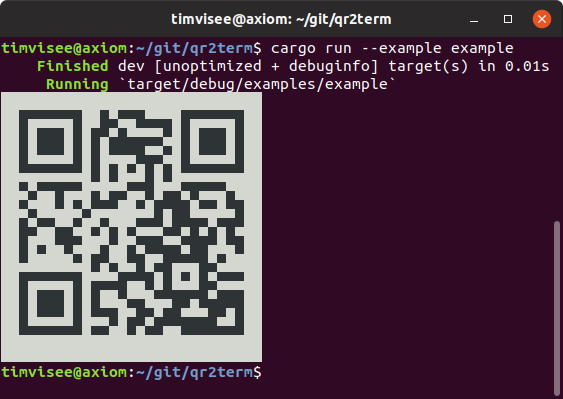

[![Build status on GitLab CI][gitlab-ci-master-badge]][gitlab-ci-link]
[![Newest release on crates.io][crate-version-badge]][crate-link]
[![Documentation][docs-badge]][docs]
[![Number of downloads on crates.io][crate-download-badge]][crate-link]
[![Project license][crate-license-badge]](LICENSE)

[crate-download-badge]: https://img.shields.io/crates/d/qr2term.svg
[crate-license-badge]: https://img.shields.io/crates/l/qr2term.svg
[crate-link]: https://crates.io/crates/qr2term
[crate-version-badge]: https://img.shields.io/crates/v/qr2term.svg
[docs-badge]: https://docs.rs/qr2term/badge.svg
[docs]: https://docs.rs/qr2term
[gitlab-ci-link]: https://gitlab.com/timvisee/qr2term-rs/pipelines
[gitlab-ci-master-badge]: https://gitlab.com/timvisee/qr2term-rs/badges/master/pipeline.svg

# Rust library: qr2term
A stupidly simple QR code renderer, that prints text as QR code to the terminal,
and nothing else.

[`example.rs`](./examples/example.rs):
```rust
fn main() {
    qr2term::print_qr("https://rust-lang.org/");
}
```



This library is based on [`qair`](https://code.willemp.be/willem/qair),
which didn't provide the renderer as a library on it's own.
Credits for the actual renderer go to it's developer.

## License
This project is licensed under the MPL 2.0 license.
Check out the [LICENSE](LICENSE) file for more information.
